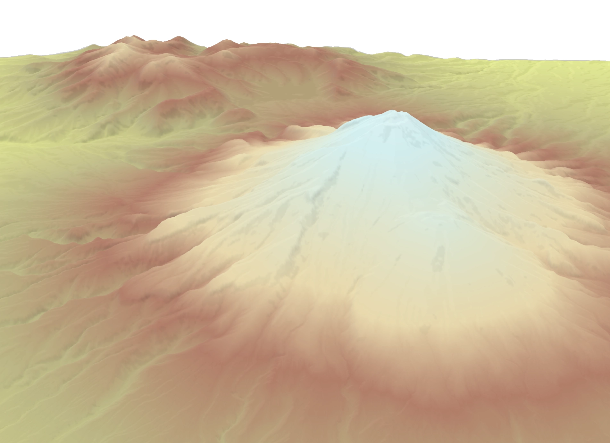

# LERC COGs as Maplibre DEM source



Grab some elevation data eg https://data.linz.govt.nz/layer/107436-taranaki-lidar-1m-dem-2021/

Make VRT

```bash
gdalbuildvrt ../BJ29.vrt *.tif
```

Create a 3857 LERC COG

```bash
 gdal_translate -of COG \
    -co TILING_SCHEME=GoogleMapsCompatible \
    -co NUM_THREADS=ALL_CPUS \
    -co BIGTIFF=NO \
    -co ADD_ALPHA=YES \
    -co BLOCKSIZE=256 \
    -co SPARSE_OK=YES  \
    -co compress=lerc -co max_z_error=0.01 \ # 1cm of error
    BJ29.vrt BJ29.lerc.cog.tiff
```

bundle everything
```bash
npm i
npm run bundle
```

Start a local webserver
```bash
serve .
open http://localhost:3000
```
